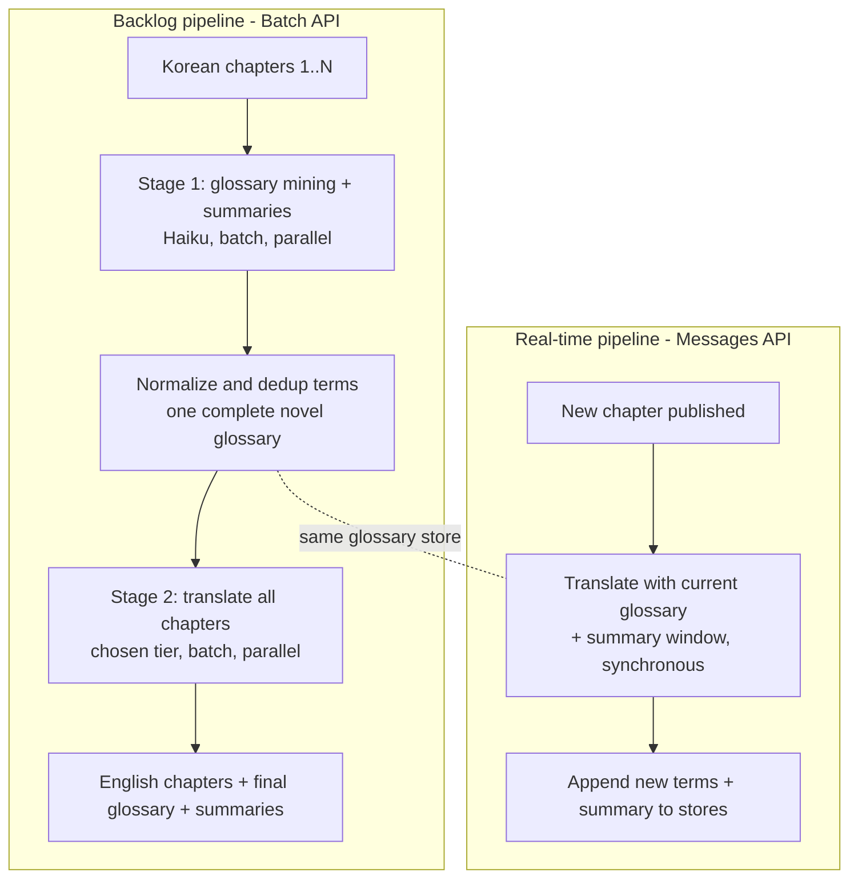

# feat: Korean-to-English webnovel translation system design

> **Showcase note.** This is the original design plan, kept for the rationale
> behind each decision. It runs against Korean web novel IP that Inkflock has
> **licensed non-exclusively via revenue share** through its content partners; no
> source texts or translations are included in this repository. Paths it
> references to the proprietary prompt files (`prompts/`), the backend handoff
> specification (`spec/`), and run artifacts (`results/`, `fixtures/`) are
> **intentionally excluded** from this public repository.

## Summary

Design and empirically validate a Claude-based translation method for Korean webnovels: prompt templates, per-chapter call architecture, glossary lifecycle, rolling-context strategy, model selection, and a cost model — plus the data contracts a future Rust/Postgres backend will implement. A small Python test harness validates every recommendation on real sample chapters before it is declared final.

---

## Problem Frame

The goal is to translate ~1,000 webnovels of ~1,000 chapters each (2-3 A4 pages of Korean per chapter, ~1M chapters total) at human-level quality. Naive per-chapter translation fails on the things readers notice most: character names drift between chapters, ranks/techniques get re-invented, plot context is lost. The two known fixes — a persistent glossary and chapter-to-chapter context — must be designed so they actually work at 1,000-chapter length without blowing up the token budget. Quality is the hard constraint; within it, cost must be minimized, because at this volume every $0.01 per chapter is $10,000.

The backend service (Rust, Postgres) is explicitly out of scope. This plan produces the *method*: prompts, schemas, pipeline shapes, and verified cost/quality numbers that the backend later implements.

---

## Requirements

**Translation outputs**

- R1. Each translated chapter yields exactly three results: the English chapter text, a list of new glossary terms (terms encountered that are not already in the supplied glossary, with chosen English renderings), and a 1-2 sentence chapter summary.
- R2. Translation quality is human-professional level: natural English prose, correct register and tone, honorifics handled per a defined policy — verified by the evaluation rubric on real chapters, not assumed.

**Consistency and context**

- R3. Glossary renderings never drift: a term established as "Azure Dragon Sect" in chapter 3 is rendered identically in chapter 800.
- R4. Translations reflect prior-chapter knowledge (character relationships, ongoing plot state) through the chapter-summary context input.

**Operation modes**

- R5. The method supports two transports with identical prompt assembly: bulk backlog translation (asynchronous, cost-optimized via the Message Batches API) and single-chapter immediate translation (synchronous, for newly published chapters).

**Economics and handoff**

- R6. A documented cost model gives per-chapter and full-corpus estimates per model tier, and the recommended configuration minimizes cost subject to the R2 quality bar.
- R7. Data contracts (glossary entry, chapter summary, translation request/result) are specified precisely enough for the Rust backend to implement its Postgres schema and API calls from this document alone.
- R8. Every load-bearing recommendation (call architecture, output format, glossary injection, model tier) is validated by harness experiments on real sample chapters, with results recorded.

---

## Key Technical Decisions

- **One translation call per chapter produces all three outputs.** The model must read the full chapter to translate it; extracting glossary terms and a summary in the same call costs only ~300 extra output tokens, while a separate extraction call would re-pay the full chapter as input (~40% cost increase) for no quality gain. The harness verifies the combined request doesn't degrade translation quality (U3); if it does, fall back to a translation call plus a cheap Haiku extraction call.
  **Measured (U3, 2026-06-10, Sonnet 4.6, 2 genres):** combined $0.059-0.065/chapter vs. split $0.080-0.092 (+36-41%), 4/4 parses OK, equivalent term extraction (15 vs 13, 7 vs 7) and summaries. Combined adopted.

- **Outputs are returned in XML-tagged sections, not JSON.** `<translation>`, `<new_glossary_terms>`, `<chapter_summary>` — translation first. Forcing a 5,000-token literary text through JSON string escaping pressures the model toward flat prose and creates parsing fragility; XML-style tags are Anthropic's recommended pattern for long structured text and are trivially parseable. The glossary-terms section alone uses a strict line format for machine parsing. Compared in U3.
  **Measured (U3, 2026-06-10, 6 runs each on dialogue-heavy chapters):** XML 0/6 parse failures; JSON 1/6 (unescaped quote — the predicted failure) plus ~10-15% higher output cost from escaping. XML adopted.

- **Glossary is injected as a prompt section, never pre-replaced in the source text.** In-place replacement corrupts Korean morphology — particles (이/가, 은/는, 을/를) attach to nouns based on their final sound, so splicing Latin renderings into Hangul text damages the very sentences being translated, and "mark and don't touch" instructions fight the model instead of helping it. A Korean→English table (term, rendering, category, one-line note) lets the model inflect naturally and is the pattern translation-tuned prompting converges on. The table is **append-only ordered** so the prompt prefix stays stable for prompt caching.
  **Measured (U3, 2026-06-10, 50-term glossary, 16 terms present in chapter):** 0 rendering violations across 2 repeats — every present term used exactly as given. Prompt-table injection confirmed.

- **Glossary extraction is done by the translator model in the same call, curated outside.** The model reports terms it had to make a rendering decision for (proper nouns, ranks/titles, techniques, places, organizations) that were absent from the supplied glossary. Rendering decisions need full translation context, which rules out separate NER tooling; the backend (later) dedups and optionally human-curates before terms become canonical. First chapter of a novel runs with an empty glossary.

- **Context = rolling window + arc summary, bounded at ~2K tokens regardless of chapter count.** The chapter input carries: the last ~20 chapter summaries verbatim, plus one cumulative "story so far" arc summary regenerated every ~50 chapters from accumulated chapter summaries (a cheap separate Haiku call). Sending all prior summaries would cost ~50K tokens per chapter by chapter 1,000; a fixed window plus periodic compression keeps cost flat and is how long-running narrative continuity is normally handled. Window/regeneration sizes are tuned in U5.
  **Measured (U5, 2026-06-10, scaled-down window 3 / regen 5 over 10 chapters):** mechanism works — arc regenerated cleanly, continuity held across the window boundary, glossary growth converged (12→28 terms over 10 chapters). Production sizes (20/50) unchanged.

- **Backlog pipeline is two-stage to break the sequential dependency.** Chapter N+1 needs the glossary produced by chapter N, which would force 1,000 sequential rounds per novel and weak early-chapter consistency. Instead: **Stage 1** runs a cheap glossary-mining + summarization pass (Haiku, Batch API) over all chapters of a novel from the Korean source; terms are normalized once into a complete novel glossary. **Stage 2** translates all chapters fully in parallel (Batch API) with the complete glossary — chapter 1 already knows the rendering chosen for a term that matters in chapter 500. Stage 1 adds roughly $3-5 per novel; full parallelism and whole-novel consistency are worth far more. Validated in U6. The simpler alternative — sequential waves within a novel, batched across the 1,000 novels — is documented as fallback if Stage-1 mining quality disappoints.
  **Measured (U6 pilot + U5 diagnostics, 2026-06-10, 10 chapters):** mechanics fully validated — batches ended in 61s/122s, 20/20 requests succeeded, $0.032/chapter all-in at the batch discount. The predicted risk materialized in mild form: raw Haiku-mined glossary gave 81/116 adherence vs 96-100% curated, caused by a few defective entries (slashed alternatives like `settlement/tribe`, romanization-vs-semantic conflicts) repeated across chapters — not by translation drift. Adopted mitigation: a normalization gate between stages (drop slashed renderings + ~5-min human skim of the ~48-term merged glossary per novel); see spec §4. Full sequential-wave fallback not needed.

- **Real-time mode is single-stage incremental.** A newly published chapter is translated synchronously (standard Messages API) with the current glossary and summary window; its new terms and summary are appended afterward. Same prompt assembly as Stage 2, different transport — satisfying R5 with one prompt to maintain.
  **Measured (U5, 2026-06-10, 10 sequential chapters):** 96% whole-run adherence with the self-built glossary, zero character-name drift after ch1, 2/21 calls used their single retry (a `NONE`-with-commentary parse case, parser now tolerant). Cache hits on 4/9 follow-ups covered only the ~1.3K-token instruction block — caching confirmed third-order at this prompt size.

- **Model tier is decided by evaluation, working downward from the strongest model.** The harness runs identical sample chapters through Opus 4.8, Sonnet 4.6, and Haiku 4.5, scored by rubric (LLM-as-judge with the strongest model, plus a human review sheet) on MTL-prone failure modes: name consistency, honorifics, idiom handling, tone register, fight-scene flow. Expectation going in is that Sonnet 4.6 is the sweet spot; the decision is made on evidence (U4). A hybrid (strong model for the first ~10 chapters of a novel to set voice and glossary style, cheaper tier after) is tested as a cost option.
  **Measured (U4, 2026-06-10, 3 genres, blind Opus-judged pairwise):** Opus 5 wins / Sonnet 4 / Haiku 0. Haiku loses every pairing with substantive accuracy errors per chapter (meaning inversions, wrong numbers, in-chapter name drift) — rejected as translator at the human-level bar, retained for Stage-1 mining. Sonnet ties Opus on accuracy (judge: "accuracy essentially tied"; 1 outright Sonnet win); Opus's wins are driven mainly by no-glossary name-consistency, which the production glossary supplies. **Sonnet 4.6 adopted as default translator ($0.061/ch sync vs Opus $0.126); Opus is a per-novel premium option.** The Sonnet→Haiku hybrid is dead: Haiku's failures are accuracy, not consistency, so a glossary cannot rescue it. Note: `temperature` is rejected (400) by the newest models — judge calls run at default sampling.

- **Prompt caching is layered in but treated as second-order.** Output tokens are ~75% of per-chapter cost, so caching (input-side only) cannot rescue a wrong model-tier choice. Still: static system instructions get a `cache_control` breakpoint, and the append-only glossary ordering means sequential real-time translation within the 5-minute TTL reuses most of the prefix at 0.1× price. Batch-mode cache hits are best-effort and not counted on in the cost model.

---

## High-Level Technical Design

Two pipelines share one prompt assembly:



Per-chapter prompt assembly (Stage 2 and real-time identical), ordered for cache-prefix stability:

```text
[system, cached]   Translator persona, style rules, honorifics policy, output format spec
[system, cached]   Glossary table (append-only order): KO term | EN rendering | category | note
[user]             Arc summary ("story so far", regenerated every ~50 chapters)
[user]             Last ~20 chapter summaries
[user]             Korean chapter text
-> output          <translation> ... </translation>
                   <new_glossary_terms> one term per line, strict format </new_glossary_terms>
                   <chapter_summary> 1-2 sentences </chapter_summary>
```

This sketch is directional guidance; exact wording and field shapes are produced and tuned by U2/U3.

---

## Cost Model (initial estimates — verified and finalized in U6)

Working numbers per chapter: ~9K input tokens (instructions ~1K, glossary ~2K, context ~2K, chapter ~4K), ~5K output tokens. Prices below are batch rates (50% of standard) believed current as of June 2026; **the harness must verify against the live pricing page** before the numbers are finalized.

| Tier (Stage 2) | Est. $/chapter (batch) | Est. full corpus (1M ch.) | Per novel |
|---|---|---|---|
| Opus 4.8 | ~$0.085 | ~$85K | ~$85 |
| Sonnet 4.6 | ~$0.051 | ~$51K | ~$51 |
| Haiku 4.5 | ~$0.017 | ~$17K | ~$17 |
| Hybrid (Sonnet first 10 ch. + Haiku rest) | ~$0.017-0.020 | ~$18-20K | ~$18-20 |

Stage 1 (Haiku mining pass) adds ~$3-5 per novel (~$3-5K corpus-wide). Real-time chapters pay standard (non-batch) rates — negligible at one-chapter-at-a-time volume. Output tokens dominate (~75% of spend), so model tier is the first-order cost lever, batch the second, caching third.

---

## Implementation Units

### U1. Harness scaffolding and sample fixtures

- **Goal:** A runnable Python harness skeleton (throwaway-quality is fine) that assembles prompts from fixture files, calls the API, and records token usage and cost per call.
- **Requirements:** R8 (foundation for all experiments)
- **Dependencies:** none. Blocking input: 5-10 real Korean sample chapters from the user, ideally consecutive chapters of one novel plus singles from 2-3 different genres.
- **Files:** `harness/run.py`, `harness/prompts.py`, `harness/costs.py`, `fixtures/<novel>/chNNN.txt`, `fixtures/README.md`
- **Approach:** Plain `anthropic` SDK, no framework. Every call logs model, input/output/cache token counts, and computed cost to a JSONL results file so experiments are comparable. `ANTHROPIC_API_KEY` from environment; fail at startup if missing.
- **Test scenarios:**
  - Happy path: harness translates one fixture chapter end-to-end and writes a result record with non-zero token counts and a parsed three-part output.
  - Error path: missing API key exits with a clear message before any API call; a malformed/empty fixture file is reported, not silently skipped.
  - Cost accounting: computed cost for a known token count matches hand calculation against the pricing table.
- **Verification:** One command translates one chapter and prints translation, extracted terms, summary, and cost.

### U2. Prompt templates v1

- **Goal:** The core artifact — system prompt (translator persona, English style rules, honorifics policy, output format spec) and the prompt-assembly function (glossary section, arc summary, summary window, chapter).
- **Requirements:** R1, R2, R3, R4
- **Dependencies:** U1
- **Files:** `prompts/system.md`, `prompts/assembly.md` (documented template), wired into `harness/prompts.py`
- **Approach:** Follow the prompt-assembly sketch in High-Level Technical Design. Style rules name the failure modes explicitly (no translationese, preserve tone register shifts, render onomatopoeia naturally). Honorifics policy is parameterized — see Open Questions; both variants drafted so U3 can compare on real text.
- **Test scenarios:**
  - Covers R1: output of a fixture translation parses into exactly three sections; glossary-terms lines match the strict format.
  - Covers R3: a chapter containing three pre-seeded glossary terms renders all three exactly as the glossary specifies.
  - Empty inputs: chapter 1 conditions (empty glossary, no summaries) produce a valid prompt with those sections cleanly absent, not empty-header noise.
- **Verification:** Two consecutive fixture chapters translated with the v1 template read as natural English to a human check and use seeded glossary terms verbatim.

### U3. Call-architecture and format experiments

- **Goal:** Settle, with measurements, the decisions currently held as expectations: combined three-output call vs. translate-then-extract; XML tags vs. JSON output; glossary-in-prompt effectiveness.
- **Requirements:** R1, R2, R8
- **Dependencies:** U2
- **Files:** `harness/experiments/`, results in `results/u3-*.jsonl`, findings appended to this plan's spec deliverable (U7)
- **Approach:** Same fixture chapters across variants, one variable at a time, identical model. Quality compared via LLM-judge (strongest model, rubric scoring both variants blind) plus human read of flagged differences; cost compared from the recorded token counts.
- **Test scenarios:**
  - Combined vs. split: judge scores within noise → combined wins on cost; if combined translation is measurably worse, record the margin and adopt the split (Haiku extraction) fallback.
  - XML vs. JSON: parse-failure rate over the sample set and judge prose-quality comparison; deliberately include a chapter with dialogue-heavy quoting to stress escaping.
  - Glossary adherence under load: 50-term glossary with 10 terms present in the chapter — count rendering mismatches (target: zero).
- **Verification:** Each decision in Key Technical Decisions affected by this unit is either confirmed or amended in the plan/spec with the measured evidence cited.

### U4. Model tier evaluation

- **Goal:** Pick the Stage-2 translation tier (and decide on the hybrid option) with evidence against the human-level quality bar.
- **Requirements:** R2, R6, R8
- **Dependencies:** U3 (settled format/architecture)
- **Files:** `harness/experiments/`, `results/u4-*.jsonl`, `eval/rubric.md`, `eval/human-review-sheet.md`
- **Approach:** Identical chapters through Opus 4.8 / Sonnet 4.6 / Haiku 4.5. Rubric dimensions: name/term consistency, honorifics, idiom naturalness, tone register, action-scene readability, dialogue voice. LLM-judge ranks blind; human review sheet (the user) breaks ties and sets the bar — "human level" is ultimately the user's read, not the judge's score. Also verify current per-MTok pricing here and update the cost model table.
- **Test scenarios:**
  - Tier ranking reproduces across at least two genres (e.g., murim/fantasy vs. modern romance) — a tier that wins on one genre but fails another can't be the blanket recommendation.
  - Hybrid test: Haiku translating chapter 11+ with a Sonnet-built glossary and summaries — judge whether quality holds once voice/terms are established.
  - Judge sanity check: judge ranks a deliberately degraded translation (names swapped mid-chapter) last.
- **Verification:** A recommended tier (or hybrid) is recorded with rubric scores, the user has signed off on sample output quality, and the cost-model table is updated with verified prices.

### U5. Glossary lifecycle and context tuning

- **Goal:** Validate term extraction quality and context continuity over a real multi-chapter run; fix window sizes and glossary normalization rules.
- **Requirements:** R3, R4, R8
- **Dependencies:** U4 (run with the chosen tier); requires the consecutive-chapter fixture set
- **Files:** `harness/sequential.py`, `results/u5-*.jsonl`, contracts draft in `spec/data-contracts.md`
- **Approach:** Translate ~10 consecutive chapters end-to-end in incremental mode (each chapter's extracted terms and summary feed the next). Then re-run in two-stage mode (mine first, translate parallel) and compare consistency. Define normalization rules discovered along the way (dedup by Korean surface form, category vocabulary, collision handling when the model proposes a second rendering for a known term).
- **Test scenarios:**
  - Covers R3: a character introduced in chapter 1 is rendered identically in all 10 chapters, both modes.
  - Covers R4: a plot fact established in chapter 2 (a relationship, a debt, an injury) is correctly reflected when referenced in chapter 9.
  - Extraction precision: terms extracted from one chapter reviewed by hand — measure noise rate (common nouns wrongly proposed) and miss rate (obvious proper nouns not proposed).
  - Window boundary: with a 20-summary window, a fact from a chapter outside the window survives via the arc summary.
- **Verification:** The 10-chapter run reads continuously to a human; glossary store after the run contains no duplicate or drifted entries; window/regeneration sizes are pinned in the spec.

### U6. Transport patterns: batch pilot and real-time flow

- **Goal:** Prove the two-stage batch pipeline and the real-time flow against the live APIs, including prompt caching behavior, and finalize the cost model.
- **Requirements:** R5, R6, R8
- **Dependencies:** U5
- **Files:** `harness/batch_pilot.py`, `harness/realtime.py`, `results/u6-*.jsonl`
- **Approach:** Stage-1 mining pilot over the consecutive-chapter set as one batch; Stage-2 translation as a second batch; measure wall-clock completion, per-request success, cost vs. estimate. Real-time path: translate one chapter synchronously and confirm cache-read tokens appear on a second sequential chapter within the TTL.
- **Test scenarios:**
  - Batch happy path: all requests in both stages complete; results map back to chapters via `custom_id`; combined cost within ~20% of the model's estimate (else the cost model is corrected).
  - Failure path: a poisoned request (oversized/malformed) in a batch fails alone without sinking the batch; the harness surfaces which chapter failed.
  - Caching: second sequential real-time chapter shows non-zero `cache_read_input_tokens`; measured savings recorded.
- **Verification:** Cost-model table carries measured (not estimated) figures for the pilot novel, extrapolated to corpus scale with assumptions stated.

### U7. System specification — the backend handoff document

- **Goal:** A single spec the Rust backend can be built from: final prompt templates, data contracts, both pipeline definitions, model/API configuration, and the verified cost model.
- **Requirements:** R7, R6
- **Dependencies:** U3-U6 (consumes their settled decisions)
- **Files:** `spec/translation-system.md`, `spec/data-contracts.md`, final `prompts/`
- **Approach:** Data contracts as language-neutral schemas (field, type, constraints, example) for: glossary entry, chapter summary, arc summary, translation request, translation result, batch job bookkeeping. Pipeline sections specify ordering, retry posture, and glossary-append semantics precisely enough that no design decisions remain — only Rust implementation.
- **Test scenarios:** Test expectation: none — documentation unit. Acceptance check instead: a reader with no access to this conversation can answer, from the spec alone, "what exactly is sent to the API for chapter N, and what is written back?"
- **Verification:** User review of the spec; every R1-R8 requirement traceable to a spec section.

---

## Scope Boundaries

**Out of scope**

- The Rust backend service, its Postgres schema/DDL, queueing, and API surface — this plan delivers the contracts it implements.
- Acquiring, scraping, or licensing Korean source texts.
- Reader-facing UI, publishing formats (EPUB etc.), and distribution.

**Deferred to follow-up work**

- Human review / post-editing workflow at production scale (the eval rubric from U4 is a starting point).
- Production quality monitoring (drift detection, reader feedback loops).
- Per-novel style presets beyond the honorifics policy (e.g., genre-specific style rules), if U4 shows genre sensitivity.

---

## Open Questions

- **Honorifics policy:** keep romanized honorifics (-nim, -ssi, hyung/oppa) as webnovel readers often expect, or fully localize into English forms of address? Both variants are drafted in U2 and compared on real text in U3; user picks on samples. The choice is per-corpus configuration, not architecture.
- **Sample fixtures:** U1 is blocked until the user supplies 5-10 real chapters (consecutive run of one novel + singles from 2-3 genres). Licensing of those samples is the user's call.

---

## Risks & Dependencies

- **Pricing and model churn.** Prices and model lineup change; the cost model is re-verified in U4/U6 against live pricing before being declared final. Estimates in this plan are planning-grade only.
- **Glossary growth at 1,000 chapters.** Long novels may accumulate 300-500+ terms (~4-6K prompt tokens). Mitigations, in order: category-based curation (drop one-off minor terms), then per-chapter relevance filtering as a fallback — noting filtering trades away cache-prefix stability, so it is adopted only if measured glossary bloat outweighs measured cache savings.
- **Stage-1 mining quality.** If Haiku's Korean-source term mining misses too much (U5 measures this), the fallback is sequential waves within each novel batched across novels — slower wall-clock, same cost class.
- **Batch API completion variance.** Batches complete within 24h with no SLA on faster; the backlog schedule must tolerate this. Real-time mode is unaffected.
- **Rate limits at corpus scale.** Running ~1M chapters needs usage-tier headroom; worth confirming the account's batch queue limits before full runs (operational note for the backend, recorded in the spec).

---

## Sources & Research

- `claude-api` reference skill (everything-claude-code 1.10.0): Batches API mechanics and 50% discount, prompt caching via `cache_control` with ~0.1× cached-read pricing, usage-field accounting. Its model table is one generation stale; current lineup (Opus 4.8 / Sonnet 4.6 / Haiku 4.5) used instead, with pricing verification pushed into U4/U6.
- Korean morphology constraint (particle attachment by final sound) is the load-bearing fact behind rejecting in-place glossary replacement.
- Output-token dominance (~75% of per-chapter spend at current price ratios) is the load-bearing fact behind treating model tier as the first-order cost lever and caching as third.
